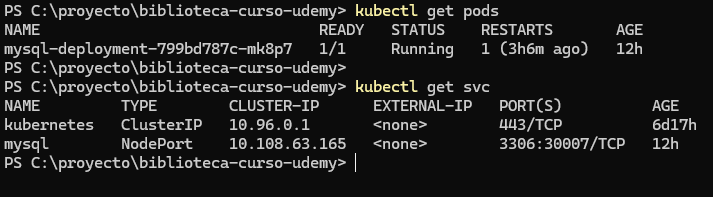
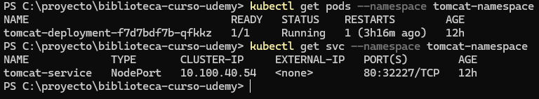

# devops
Repositorio de proyecto CRUD Spring Boot para ser ejecutado en contenedores con Docker y Kubernetes

## Configuracion inicial
1 - Instalar Jenkins sobre Windows: https://www.jenkins.io/doc/book/installing/windows/ \
2 - Instalar Docker sobre Windows: https://docs.docker.com/desktop/setup/install/windows-install/ \
3 - Instalar Kubernetes: https://kubernetes.io/es/docs/tasks/tools/included/install-kubectl-windows/ 

## Instalacion MySQL en Kubernetes 
1 - Clonar repositorio en su equipo local \
2 - Abrir terminal y ubicarse en directorio donde están los archivos del repositorio \
3 - Ejecutar comando kubcetl para crear secreto para clave de root de Mysql 
```PS
kubectl create secret generic mysql-root-pass --from-literal=password=remliw23
```
4 - Crear secreto para nombre de base de datos 
```PS
kubectl create secret generic mysql-db-url --from-literal=database=mysqlproy
```
5 - Ejecutar comando kubectl archivo YAML mysql.yaml
```PS
kubectl apply -f mysql.yaml
```
6 - Validar ejecución del servicio
```PS
kubectl get pods
```
```PS
kubectl get svc
```


## Instalación de Tomcat en Kubernetes
1 - Abrir terminal y ubicarse en directorio donde están los archivos del repositorio \
2 - Crear namespace para Tomcat
```PS
kubectl create namespace tomcat-namespace
```
3 - Ejecutar comando kubectl archivo YAML mysql.yaml
```PS
kubectl apply -f tomcat.yaml
```
4 - Validar ejecución del servicio
```PS
kubectl get pods --namespace tomcat-namespace
```
```PS
kubectl get svc --namespace tomcat-namespace
```
 \
5 - Debido a que Jenkins y el servidor Tomcat en Kubernetes no se encuentran en el mismo host, se debe habilitar el acceso remoto a Tomcat, para esto es necesario configurar el archivo context.xml ubicado en el directorio $CATALINA_HOME/webapps/manager/META-INF/context.xml, la ruta $CATALINA_HOME corresponde a la ruta de donde se haya instalado apache-tomcat. Buscar el segmento que inicia con valve y comentarlo como está en el siguiente código:
```XML
<Context antiResourceLocking="false" privileged="true" >
  <CookieProcessor className="org.apache.tomcat.util.http.Rfc6265CookieProcessor"
                   sameSiteCookies="strict" />
  <!--Valve className="org.apache.catalina.valves.RemoteAddrValve"
         allow="127\.\d+\.\d+\.\d+|::1|0:0:0:0:0:0:0:1" /-->
  <Manager sessionAttributeValueClassNameFilter="java\.lang\.(?:Boolean|Integer|Long|Number|String)|org\.apache\.catalina\.filters\.CsrfPreventionFilter\$LruCache(?:\$1)?|java\.util\.(?:Linked)?HashMap"/>
</Context>
```
6 - Verificar que los usuarios tengan permisos y asignados en el archivo tomcat-users.xml, el cual está en la ruta $CATALINA_HOME/apache-tomcat-9.0.50/conf/tomcat-users.xml
```XML
<role rolename="admin-gui"/>
<role rolename="admin-script"/>
<role rolename="manager-status"/>
<role rolename="manager-script"/>
<role rolename="manager-gui"/>
<user username="tomcat" password="tomcat" roles="admin-script,admin-gui,manager-script,manager-gui,manager-status" />
<user username="admin" password="tomcat" roles="admin-script,admin-gui,manager-script,manager-gui,manager-status" />
```
**Importante:** En las últimas versiones de tomcat los archivos vienen en el fichero webapps.dist y no en webapps, por lo que se debe copiar todo el contenido de webapps.dist a webapp \
7 - Reiniciar el servidor para aplicar los cambios

## Despliegue de archivo WAR en Tomcat desde Jenkins
1 - Dentro de Jenkins se debe crear una nueva tarea \
2 - Escribir el nombre para el proyecto \
3 - Seleccionar "Crear un proyecto de estilo libre" y presionar botón OK \
4 - En apartado "General", agregar una breve descripción del proyescto (Opcional) \
5 - En apartado "Configurar origen del código fuente" seleccionar Git \
6 - En URL del repositorio colocar https://github.com/wvaa/devops.git, Dado que el repositorio es público no solicitara credenciales \
7 - En "Branches to Build" reemplazar */master por */main \
8 - En "Acciones para ejecutar después" seleccionar "Deploy war/ear to a container \
9 - Colocar el nombre del WAR que se descarga con el repositorio \
10 - En "Containers" dar clic sobre "Add Container" y seleccionar Tomcat 9.x Remote \
11 - En Credential seleccionar "Add" y despues Jenkins, se mostrara la siguiente ventana en donde se debe colocar las credenciales de Tomcat (definidas en el paso 8 de la sección **Instalacion de Tomcat en Kubernetes**) \
12 - Dar Clic en "Add" \
13 - Seleccionar las credenciales que se acaban de crear \
14 - Colocar URL con la que se accede a Tomcat que es http://localhost:32227 (esto de acuerdo a lo configurado en Kubernetes) \
15 - Clic en "Apply" y luego en "Guardar" \
16 - Ejecutar haciendo clic en "Construir ahora" 

## Ejecutar peticiones al servicio

1 - Importar a Postman la colección **testService.postman_collection.json** \
2 - Seleccionar request "crear autor" y ejecutar la petición \
3 - Seleccionar request "Consultar autor" y ejecutar la petición


